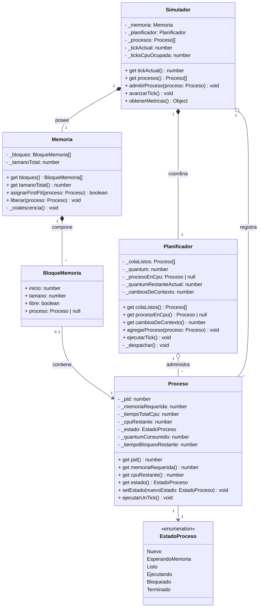
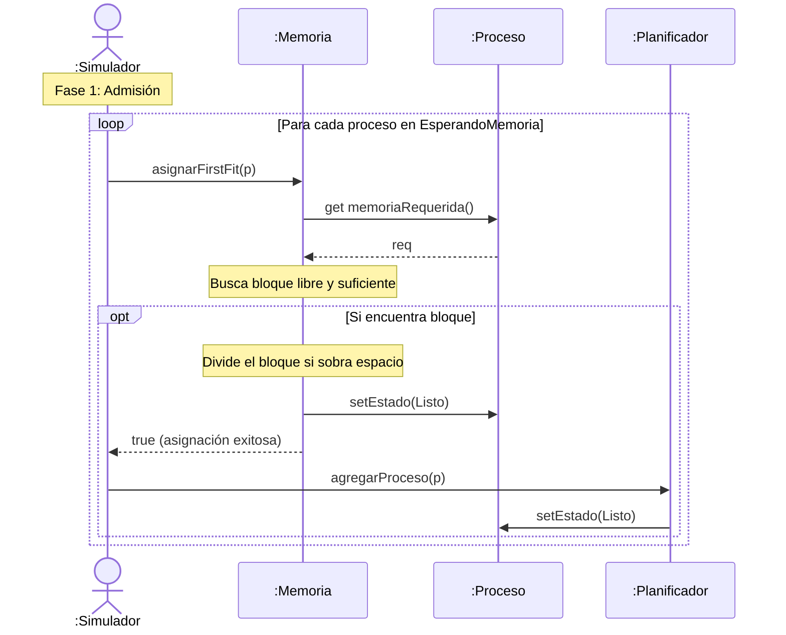
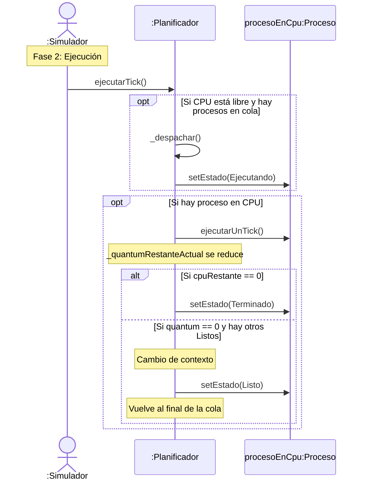
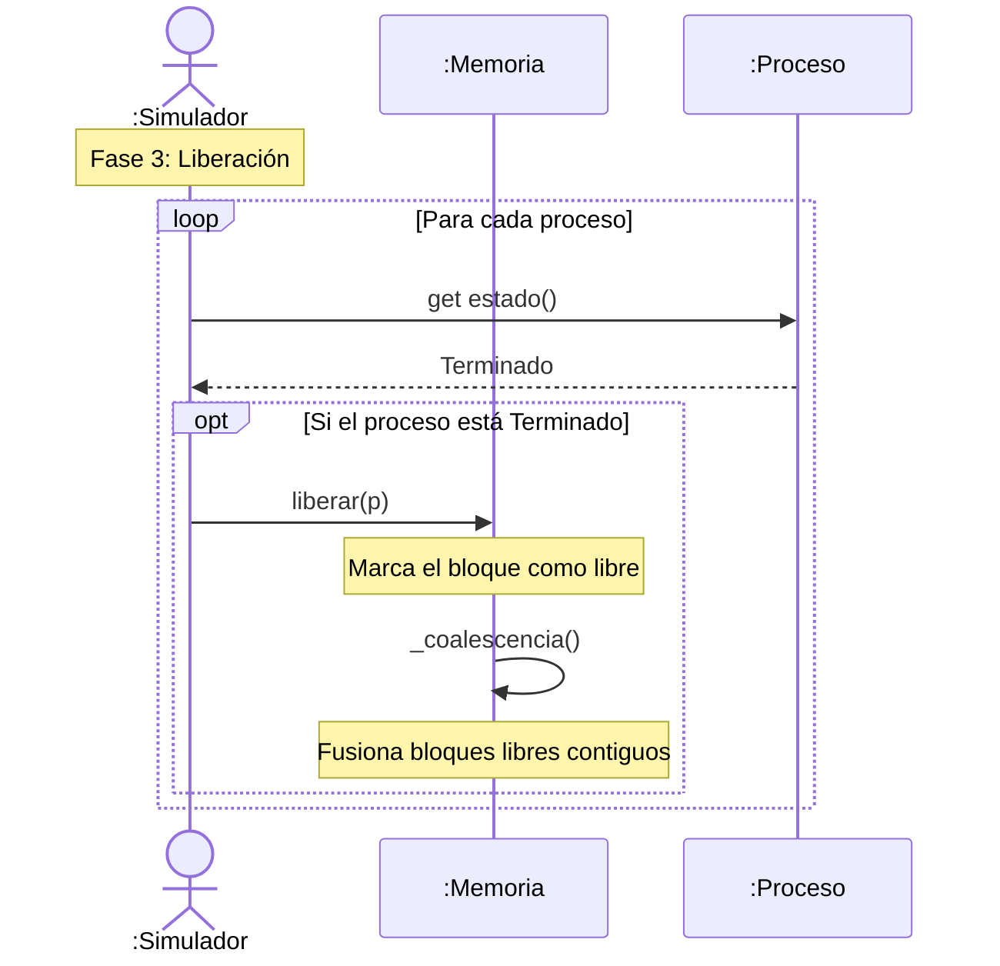

# Diagrama de Clases

```mermaid
classDiagram
    class EstadoProceso {
        <<enumeration>>
        Nuevo
        EsperandoMemoria
        Listo
        Ejecutando
        Bloqueado
        Terminado
    }

    class Proceso {
        - _pid: number
        - _memoriaRequerida: number
        - _tiempoTotalCpu: number
        - _cpuRestante: number
        - _estado: EstadoProceso
        - _quantumConsumido: number
        - _tiempoBloqueoRestante: number
        + get pid() number
        + get memoriaRequerida() number
        + get cpuRestante() number
        + get estado() EstadoProceso
        + setEstado(nuevoEstado: EstadoProceso) void
        + ejecutarUnTick() void
    }

    class BloqueMemoria {
        + inicio: number
        + tamano: number
        + libre: boolean
        + proceso: Proceso | null
    }

    class Memoria {
        - _bloques: BloqueMemoria[]
        - _tamanoTotal: number
        + get bloques() BloqueMemoria[]
        + get tamanoTotal() number
        + asignarFirstFit(proceso: Proceso) boolean
        + liberar(proceso: Proceso) void
        - _coalescencia() void
    }

    class Planificador {
        - _colaListos: Proceso[]
        - _quantum: number
        - _procesoEnCpu: Proceso | null
        - _quantumRestanteActual: number
        - _cambiosDeContexto: number
        + get colaListos() Proceso[]
        + get procesoEnCpu() Proceso | null
        + get cambiosDeContexto() number
        + agregarProceso(proceso: Proceso) void
        + ejecutarTick() void
        - _despachar() void
    }

    class Simulador {
        - _memoria: Memoria
        - _planificador: Planificador
        - _procesos: Proceso[]
        - _tickActual: number
        - _ticksCpuOcupada: number
        + get tickActual() number
        + get procesos() Proceso[]
        + admitirProceso(proceso: Proceso) void
        + avanzarTick() void
        + obtenerMetricas() Object
    }

    Proceso "1" --> "1" EstadoProceso
    BloqueMemoria "0..1" --> "1" Proceso : contiene
    Memoria "1" *-- "*" BloqueMemoria : compone
    Planificador "1" o-- "*" Proceso : administra
    Simulador "1" *-- "1" Memoria : posee
    Simulador "1" *-- "1" Planificador : coordina
    Simulador "1" o-- "*" Proceso : registra
```

# Secuencia: Asignación de Memoria (First-Fit)

```mermaid
sequenceDiagram
    actor S as :Simulador
    participant M as :Memoria
    participant P as :Proceso
    participant PL as :Planificador

    Note over S: Fase 1: Admisión
    loop Para cada proceso en EsperandoMemoria
        S->>M: asignarFirstFit(p)
        M->>P: get memoriaRequerida()
        P-->>M: req
        Note over M: Busca bloque libre y suficiente
        opt Si encuentra bloque
            Note over M: Divide el bloque si sobra espacio
            M->>P: setEstado(Listo)
            M-->>S: true (asignación exitosa)
            S->>PL: agregarProceso(p)
            PL->>P: setEstado(Listo)
        end
    end
```

# Secuencia: Tick de Round-Robin

```mermaid
sequenceDiagram
    actor S as :Simulador
    participant PL as :Planificador
    participant P as procesoEnCpu:Proceso

    Note over S: Fase 2: Ejecución
    S->>PL: ejecutarTick()
    
    opt Si CPU está libre y hay procesos en cola
        PL->>PL: _despachar()
        PL->>P: setEstado(Ejecutando)
    end
    
    opt Si hay proceso en CPU
        PL->>P: ejecutarUnTick()
        Note over PL: _quantumRestanteActual se reduce
        
        alt Si cpuRestante == 0
            PL->>P: setEstado(Terminado)
        else Si quantum == 0 y hay otros Listos
            Note over PL: Cambio de contexto
            PL->>P: setEstado(Listo)
            Note over PL: Vuelve al final de la cola
        end
    end
```

# Secuencia: Liberación y Coalescencia

```mermaid
sequenceDiagram
    actor S as :Simulador
    participant M as :Memoria
    participant P as :Proceso

    Note over S: Fase 3: Liberación
    loop Para cada proceso
        S->>P: get estado()
        P-->>S: Terminado
        
        opt Si el proceso está Terminado
            S->>M: liberar(p)
            Note over M: Marca el bloque como libre
            M->>M: _coalescencia()
            Note over M: Fusiona bloques libres contiguos
        end
    end
```